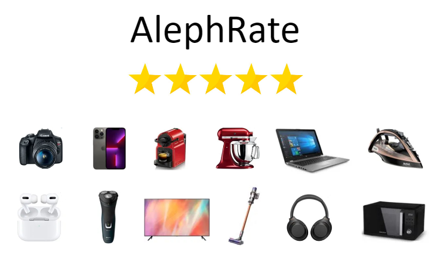

# AlephRate
This repository contains our AlephRank project which tries to predict the rank of a product(1-5) using its reviews by using tools from classic NLP and more advanced approaches from the Machine Learning and Deep Learning domains.

 
 

**Revie - Customer Recommendation System**
 
Additionally we built [Revie](https://orig333-reviedemo-recommendation-system-fvdkoj.streamlitapp.com/) a recommendation system which allows a user
to choose features that are important to him in a product and get back the most suitable products for him.  

